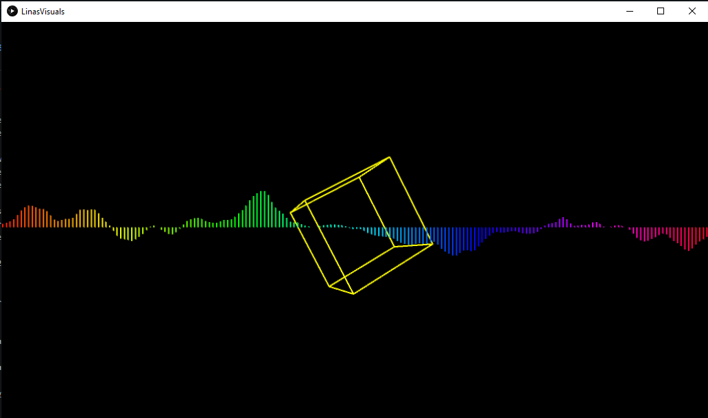

# Music Visualiser Project

Name: Lina Mir

Student Number: C19366191

# Description of the assignment
This assignment required me to create "something beautiful to enjoy while listening to music." 

I created a visual art piece that responds to the amplitude of the music by creating a music visualiser using processing in java. My assignment uses both 2D and 3D shapes.
The songs I used were a few different songs esspecially when I was testing the different wavelengths. 
I couldn't decide what song I wanted to use to I put in 3 different songs but the YouTube video plays 2 of them to demonstrate the potential amplitude it reaches.
The YouTube video plays the files Dharma.mp3 and FeelSoClose.mp3.

I wanted to create visuals that responded to the music. The music to me didn't have to be directly influenced by the songs because I used 3 different ones, but rather I wanted it to just respond to the song and enjoy the way the shapes and waveform change size and colour.


# Instructions
- To start the music, press the space key. This starts the music off and the visuals begin reacting. 
- To pause the music, press the space key.
- Next press either 1, 2 or 3 to see different visuals.
- If key 1 is pressed, there should be a sphere.
- Press key 2 to see many circles forming a vortex.
- Pressing key 3 will produce a cube with a waveform in the centre.
- Key 4 shows a pyramid.

# How it works
I created a few branches to work on different things and then when I was satisfied I merged the work from the branches onto the master branch. This really helped me try out different thing before I decided what I wanted and commited it to the master. I created branches often because it was hard for me to decide what to do with so many options!

The main file that calls all the other files is called LinasVisuals.java. The way it works is like this:
Variables are created for the files so they can be easily accessed.
```Java
public class LinasVisuals extends Visual
{
	Wave wave;
	Sphere sphere;
	Pryamid pyramid;
	Cube cube;
	Circle circle;
	
	...
}
```

Next, in the setup method, the files are called:
```Java
public void setup()
{ 
	...
	
	wave = new Wave(this);
        sphere = new Sphere(this);
        pyramid = new Pryamid(this);
        cube = new Cube(this);
        circle = new Circle(this);
}

```

Then finally in the draw method, the variable and the method used to created the shapes are called:
```Java
public void draw()
{ 
	...
	
 	if (key == '1')
        {
            sphere.render();    
        }
        if (key == '2')
        {            
            //pyramid.render();
            circle.render();                     
        }
        if (key == '3')
        {
            cube.render();
            wave.render();
        }
}

```

## Keys
Pressing key 1 will produce a sphere and another sphere inside it. They both react to the music. One sphere is larger than the other and changes size much more than the inside sphere as it is larger. The inner sphere colour is more blue/purple and this was to style it differently to the larger sphere so that it can be seen more clearly. Both the larger sphere and the inner sphere change colour depending on the amplitude the music reaches.

Key 2 is pressed and many circles will appear. they decrease is size and this effect forms a vortex. They circles all change depending on the amplitude and increase in size too. The circles start of being red but as the music picks up, the colour of the circles change. 

When key 3 is pressed, a cube and a waveform appear. The cube moves according to the music as well as the wavelength. The wavelength reaches the length of screen size and moves according to the music and the wavelength is rainbow coloured, as according to HSB.

A pyramid appears when key 4 is pressed..........


# What I am most proud of in the assignment

# Images
Key 3: Cube and Waveform


# YouTube Video
This is the link to the video:

[](https://www.youtube.com/watch?v=J2kHSSFA4NU)


This is *emphasis*

This is a numbered list

1. Item
1. Item

This is a [hyperlink](http://bryanduggan.org)

# Headings
## Headings
#### Headings
##### Headings


This is a table:

| Heading 1 | Heading 2 |
|-----------|-----------|
|Some stuff | Some more stuff in this column |
|Some stuff | Some more stuff in this column |
|Some stuff | Some more stuff in this column |
|Some stuff | Some more stuff in this column |

