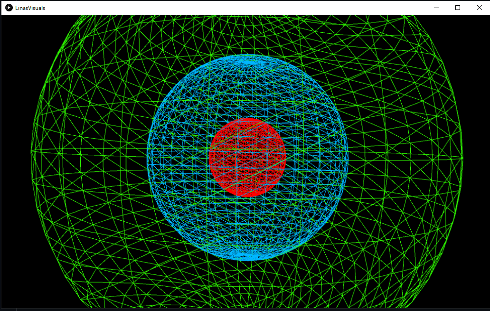

# Music Visualiser Project

Name: Lina Mir

Student Number: C19366191

# Description of the assignment
This assignment required me to create "something beautiful to enjoy while listening to music." 

I created a visual art piece that responds to the amplitude of the music by creating a music visualiser using processing in java. My assignment uses both 2D and 3D shapes.
The songs I used were a few different songs esspecially when I was testing the different wavelengths. 
I couldn't decide what song I wanted to use to I put in 3 different songs but the YouTube video plays 2 of them to demonstrate the potential amplitude it reaches.
The YouTube video plays the files Dharma.mp3 and FeelSoClose.mp3.

I wanted to create visuals that responded to the music. The music to me didn't have to be directly influenced by the songs because I used 3 different ones, but rather I wanted it to just respond to the song and enjoy the way the shapes and waveform change size and colour.


# Instructions
- First, press the space key to start the music.
- To pause the music, press the space key.
- Next press either 1, 2 or 3 to see different visuals.
- If key 1 is pressed, there should be spheres.
- Press key 2 to see many circles forming a vortex.
- Pressing key 3 will produce a cube with a waveform in the centre.


# How it works
I created a few branches to work on different things and then when I was satisfied I merged the work from the branches onto the master branch. This really helped me try out different thing before I decided what I wanted and commited it to the master. I created branches often because it was hard for me to decide what to do with so many options!

The main file that calls all the other files is called LinasVisuals.java. The way it works is like this:
The other classes use inheritance to call on the super/parent class. To do this the word extends is used.
```Java
public class LinasVisuals extends Visual
{
	Wave wave;
	Sphere sphere;
	Cube cube;
	Circle circle;
	
	...
}
```

It also uses a constructor and each class has the same constructor. 
This is an example of the constructor in Circle.java. This is how the constructor looks like for all the class files.
```Java
public Circle(LinasVisuals lv)
{
        this.lv = lv;
     
}
``` 

Next, in the setup method, objects are created in LinasVisuals.java.
```Java
public void setup()
{ 
	...
	
	wave = new Wave(this);
        sphere = new Sphere(this);
        cube = new Cube(this);
        circle = new Circle(this);
}

```

Then finally in the draw method, the variable and the method used to created the shapes are called:
```Java
public void draw()
{ 
	...
	
 	if (key == '1')
        {
            sphere.render();    
        }
        if (key == '2')
        {            
       
            circle.render();                     
        }
        if (key == '3')
        {
            cube.render();
            wave.render();
        }
}

```

## Keys
Pressing key 1 will produce a sphere and another sphere inside it. They both react to the music. One sphere is larger than the other and changes size much more than the inside sphere as it is larger. The inner sphere colour is more blue/purple and this was to style it differently to the larger sphere so that it can be seen more clearly. Both the larger sphere and the inner sphere change colour depending on the amplitude the music reaches.

Key 2 is pressed and many circles will appear. they decrease is size and this effect forms a vortex. They circles all change depending on the amplitude and increase in size too. The circles start of being all colours and stay like that.

When key 3 is pressed, a cube and a waveform appear. The cube moves according to the music as well as the wavelength. The wavelength reaches the length of screen size and moves according to the music and the wavelength is rainbow coloured, as according to HSB.


# What I am most proud of in the assignment
What I love about the assignment are the spheres. I love how the spheres look and react to the music and the best part about them is when the music brings us to the inside of the sphere. It took some time to code out the spheres and make 3 spheres, one smaller than the other. The first sphere had to react more than the other spheres and to do that I had to mess around with the lerp code, which is the code below.
```Java
boxSize = 10 + (lv.getAmplitude() * 500);
largerSphere = lerp(largerSphere, boxSize, 0.1f); 
```
Making the number mutliplied by the getAmplitude() bigger caused the sphere to react more. 

The circles took a while to do, so that was something I am proud of. I finally drew a circle but I didn't know what I wanted to do with it, so I decided to create a loop to continuous create circle, which caused a vortex look that I really liked. I messed around with the colours to make it look nice and finally decided on a multicoloured vortex.

I am also very proud of the cubes and waveform. The waveform gave me some issues when I was trying to set it up, I needed it to stretch across the whole screen, but at the beginning it was not, so I needed to figure out how to stretch it. I had to use getAudioBuffer().size() in a for loop to display the waveform across the entire screen. 

# Images
Key 1: Sphere in a sphere



Key 2: Circles


Key 3: Cube and Waveform


# YouTube Video
This is the link to the video:
Unfortunately, the resolution of the spheres are a bit low due to the video quality but the other visuals are completely fine.

[


